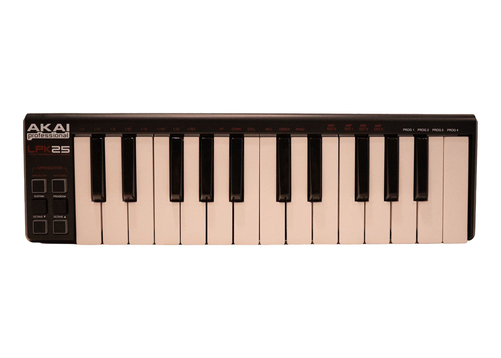

# lpk25 — Akai LPK25 mk1 editor (macOS / Linux)



A cross-platform program editor and SysEx library for the **Akai LPK25 mk1**.
The official editor only runs on Windows and legacy macOS; this project brings
program editing to modern macOS and Linux.

> **Project status: protocol confirmed against real hardware.** The mk1's SysEx
> protocol isn't publicly documented, so it was reverse-engineered directly
> against a real LPK25 mk1. The model byte (`0x76`), framing, opcodes, and **all
> 13 program bytes are verified**. The CLI can read, edit, back up, and write
> programs safely — every write
> auto-backs-up and read-back-verifies. See `docs/protocol.md` for the full byte map.

## Features

- **Read & display** all 4 programs — `show` prints a human-readable table, or
  dump to JSON.
- **Edit from the command line** — `edit <slot> --channel 5 --octave -1 …` patches
  individual parameters, with automatic backup and read-back verification.
- **Named preset library** — save a config under a name and apply it to any slot.
- **Named banks** — save/apply the whole 4-program device state by name.
- **Back up / restore** the whole device (JSON, plus raw `.syx` replay).
- **Discovery tools** — device inquiry, model-byte probing, raw MIDI capture, and a
  live MIDI monitor (the behavioural oracle used to map the protocol).
- **Shell completion** for bash/zsh/fish (`lpk25 completion <shell>`).
- A clean, fully unit-tested Python library (`lpk25`) that a future GUI can build on.

## Install

Requires Python 3.9+.

```bash
# Linux: install ALSA dev headers first so python-rtmidi can build
sudo apt-get install -y libasound2-dev   # Debian/Ubuntu

pip install -e '.[midi]'        # editable install with the MIDI backend
pip install -e '.[midi,completion]'   # ...also with tab-completion support
```

The pure-Python core (`protocol`, `codec`, `model`) imports without the `[midi]`
extra, which is handy for tests and offline use.

## Usage

```bash
lpk25 ports                 # list MIDI ports (auto-detects "LPK25")
lpk25 identify              # device inquiry + probe for the model byte
lpk25 config                # show effective settings + config file path
lpk25 completion bash       # print a tab-completion script (also zsh, fish)
lpk25 dump -o my-presets.json
lpk25 get 1 -o prog1.json
lpk25 set 1 prog1.json      # auto-backup + verify
lpk25 load my-presets.json  # write all programs
lpk25 backup                # timestamped backup into $LPK25_BACKUP_DIR
lpk25 backup list           # list backups, newest first
lpk25 backup prune --keep 5 # delete old backups, keeping the newest 5
lpk25 restore --latest      # restore the most recent backup
lpk25 restore <file>        # restore a specific backup file
lpk25 monitor               # decoded live MIDI as you play (--raw, --all, --timestamps)
lpk25 edit <slot> [--channel N --octave N --transpose N --arp on/off
                   --arp-mode M --time-div D --clock int/ext --latch on/off
                   --tempo N --taps N --arp-octave N]   change fields on a slot
lpk25 tui                                               interactive curses editor (all 4 programs)
lpk25 show [slot] [--json]                              human-readable state
lpk25 activate <slot>                                   recall a program on the device
lpk25 preset save <name> [--from-slot N] [--force]      save a slot as a preset
lpk25 preset apply <name> <slot>                        write a preset onto a slot
lpk25 preset list                                       list saved presets
lpk25 copy <src> <dst...> [--yes]                       copy a slot onto others
lpk25 bank save <name> [--force]                        save all 4 slots as a bank
lpk25 bank apply <name> [-y]                             write a bank onto all 4 slots
lpk25 bank list | show <name> | delete <name>           manage saved banks
```

`lpk25 tui` keys: ↑↓ slot · ←→ field · -/+ change · ⏎ type-in · w write · a activate ·
s/l preset · b/B bank · r reload · m monitor · q quit

Presets live in `$LPK25_PRESET_DIR` (default `~/.config/lpk25/presets`); full
4-program **banks** in `$LPK25_BANK_DIR` (default `~/.config/lpk25/banks`); and
backups (including the automatic one before every write) in `$LPK25_BACKUP_DIR`
(default `~/.config/lpk25/backups`).

### Configuration

Set defaults in `~/.config/lpk25/config.toml` (override the path with
`$LPK25_CONFIG`) so you don't repeat connection flags. Precedence is
**CLI flag > env var > config file > default**.

```toml
port = "LPK25"      # MIDI port-name substring
# in_port  = "..."  # exact input port (optional)
# out_port = "..."  # exact output port (optional)
model = 0x76        # device model byte
preset_dir = "~/Music/lpk25/presets"
bank_dir   = "~/Music/lpk25/banks"
backup_dir = "~/Music/lpk25/backups"
```

`lpk25 config` prints the effective settings and the file path.

### Shell completion

Tab-completion for subcommands, flags, and their choices (slots, arp modes,
time divisions, …) is available for bash, zsh, and fish via
[argcomplete](https://github.com/kislyuk/argcomplete) (install the extra with
`pip install '.[completion]'`). Print the script for your shell and `eval` it
from your startup file:

```bash
# bash — add to ~/.bashrc
eval "$(lpk25 completion bash)"

# zsh — add to ~/.zshrc
eval "$(lpk25 completion zsh)"

# fish — add to ~/.config/fish/config.fish
lpk25 completion fish | source
```

Run `lpk25 completion` with no argument to autodetect the shell from `$SHELL`.

Add `--dry-run` before any write command (`set`, `load`, `edit`, `copy`,
`preset apply`, `restore`) to preview the exact field/byte changes without
writing or backing up:

```bash
lpk25 --dry-run edit 1 --tempo 120 --channel 5
```

Try the CLI with no hardware using the built-in fake device:

```bash
lpk25 --mock dump
```

The model byte is confirmed as `0x76` (the default). If a future firmware
revision ever differs, override it explicitly:

```bash
lpk25 --model 0x77 dump
```

## Protocol status

The mk1 protocol was reverse-engineered against a real LPK25 mk1 and is fully
documented in [`docs/protocol.md`](docs/protocol.md): the model byte, frame
structure, opcodes, and the complete 13-byte program map — **all 13 program
bytes are hardware-confirmed**. The mapping was done with the `diff` tool (change
one setting on the device, dump, and see which byte moved) and the `monitor`
behavioural oracle (write a value, play a key, observe the note channel/number).

If you have an LPK25 mk1 and want to verify on your own unit, `lpk25 identify`,
`lpk25 diff`, and `lpk25 monitor` are the tools that drove the mapping. See
`docs/discovery-checklist.md` for the method and `docs/superpowers/specs/` for
the design.

## Development

```bash
pip install -e '.[dev]'
pytest          # unit tests run without hardware (codec/protocol/model + mock device)
ruff check .
```

## License

MIT — see `LICENSE`. Built on clean-room protocol notes; not affiliated with Akai.
